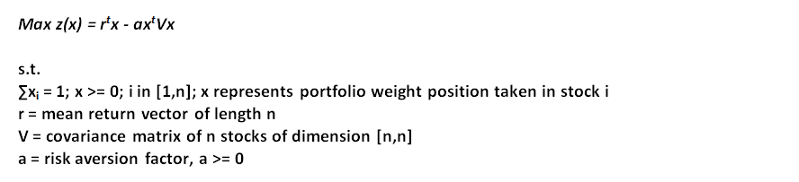
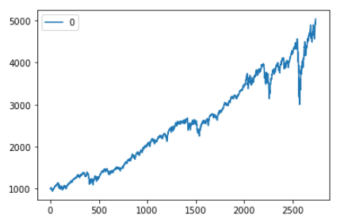
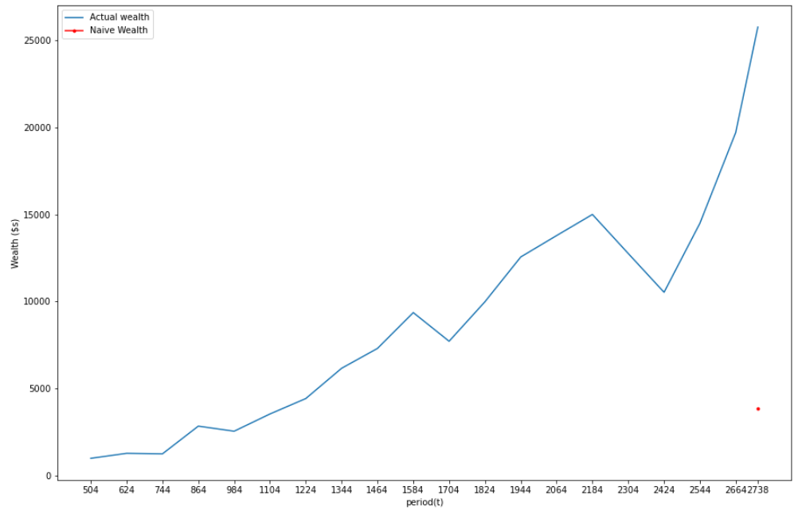
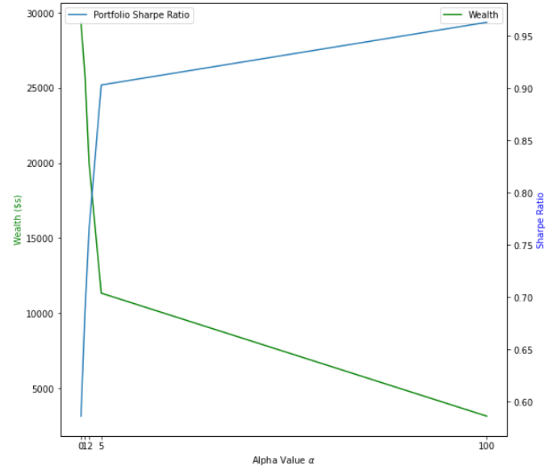
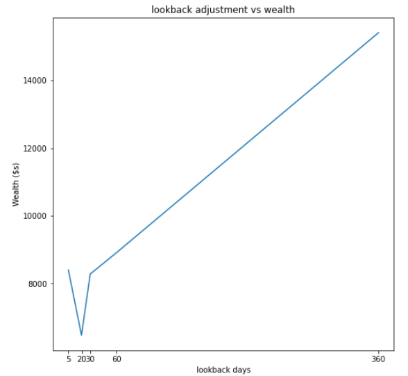
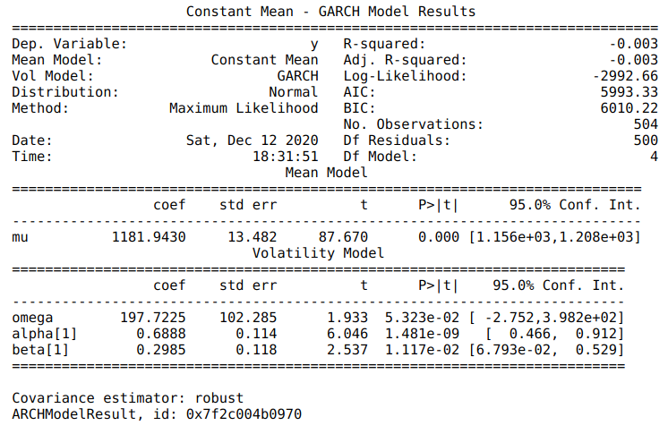
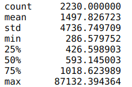
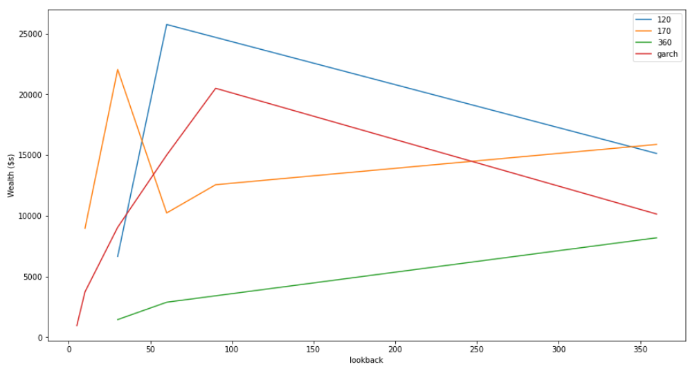

# Portfolio-Optimization-QP
Portfolio Optimization Quadratic Programming given investor risk appetite, concave PD maximization

### Purpose

The purpose of the study is to optimize via convex maximization a
portfolio of stocks Sharpe Ratio using

the equation of the Sharpe Ratio as follows:

{width="6.5in" height="1.4845286526684165in"}

For purposes of the analysis z(x) must be at least negative
semi-definite (necessary conditions) in order for a solution to be
found. Since z(x) is a quadratic function, covariance matrix V which
represents the hessian of the z(x) function must be positive
semi-definite globally since the hessian of z(x) = -alpha\*V (alpha
non-negative). The varying parameters in this study are alpha, the
aversion risk factor, the lookback period L(t) in which the window of
the stocks' mean and covariances are computed and the adjustment period
A(t) which defines the frequency of portfolio adjustment. The analysis
looks at a composite of 448 stocks (n=448) over the period 1/3/2012 --
11/17/2020 ("Period"), inclusive. Key assumptions in the study are (1)
only long positions of stocks are taken i.e. x~i~ \>= 0 and (2) the mean
return of stocks is the simple average per cent age change of stock on a
daily basis based on L(t).

### Data Inspection

Inspection of the performance of the portfolio of stocks over the Period
indicates a high rate of trajectory as shown below. The chart below was
created based on a simple portfolio of equal allocation 1/n of initial
portfolio value and the associated shares held of each stock S~i~,
tracked over daily price changes over the entire dataset:

{width="3.016479658792651in"
height="1.8828663604549432in"}

The total return over the Period is 3.87x with an implied annual
compounded rate of return of approximately 16.47% (IRR); thus starting
at initial wealth of \$1000, an investor would achieve an ending
portfolio value of \$3870 at the end of the period provided no changes
in portfolio positions were made.

### Analysis of Solver Optimization

Gurobi solver was used to solve the optimization problem based on each
adjustment period A(t). Upon initial computation of the optimization
problem, inspection of the hessian of z(x) or the covariance matrix V
revealed an indefinite matrix. This analysis was conducted utilizing
Python's numpy package eigenvalue computations of the symmetric V
matrix, which revealed both positive and negative eigenvalues. Further
inspection revealed that the negative eigenvalues were result of
numerical errors in Python Float64 data type computations. To adjust for
this error, a small perturbation was made to the covariance matrix V at
each adjustment iteration of the model:

**V = V + 0.000001\*I \| I is identity matrix of dim \[n,n\]**

Perturbations were made only to the diagonals of the V matrix, following
which the maximization function z(x) exhibited negative
semi-definiteness at each iteration of the model and an optimal solution
was found.

An example is illustrated below for the following optimization
parameters: alpha = 1, lookback = 60 days, adjustment = 120 days:

{width="5.576181102362205in"
height="3.556066272965879in"}

As shown above, final wealth value of portfolio at end of Period is
approximately \$25500 while the naïve value is \$3900. Maximizing the
Sharpe Ratio at an alpha level of 1, or risk-neutral investor yields an
approximate IRR of 43.45% over the Period, 2.67x better than the naïve
portfolio IRR.

### Parameter Analysis: Alpha

The alpha value is equal to the risk aversion of the investor, where the
increase in alpha value is reflective of a highly risk averse investor.
Thus according to the risk-return tradeoff where risk is positively
correlated with return, we suspect that as alpha value increases and the
investor seeks more stable and less volatile (standard deviation)
investments the relative portfolio value of the investor will come down,
while the portfolio Sharpe Ratio will go up. We thus illustrate this
effect under the following assumptions: lookback = 60 days, adjustment =
120 days:

{width="4.101399825021872in"
height="3.552238626421697in"}

We observe from the chart above the suspected effect on the optimization
function z(x) as alpha inf. The optimization function seeks to minimize
portfolio variance x^t^Vx -inf in order to maximize the z(x) function,
which results in a reduction in portfolio value and its return. At the
same time, the Sharpe Ratio, whose denominator is the std deviation of
the portfolio will increase as the std deviation of the portfolio
decreases given dS = -r~u~/o^2^~avg~(do) where o is the std deviation of
the portfolio. The effect is clearly visible in the chart above and thus
we conclude results are in line with expectations.

### Parameter Analysis: Lookback Period

The Lookback Period parameter does not exhibit a linear relationship
with portfolio value much like the alpha value. The tradeoff in the
lookback period optimization value stems from two conflicting theories:
(i) according to the Law of Large Numbers, as the \# of samples
infinity, the mean value of the sample set will approach the true
population sample (LLN) and (ii) the behavior of an asset price exhibits
a Markov Process where P(S~t~ = P~t~ \| S~t-1~ = P~t-1~ & S~t-2~ =
P~t-2~...) = P(S~t~ = P~t~ \| S~t-1~ = P~t-1~); that is to say the price
of a stock at future time T given historical performance is only based
on its current value today. Research into the effect of lookback period
further indicates that the lookback period is a function of the
adjustment frequency of the portfolio value, where a negative
relationship is exhibited such that as the frequency of
trading/portfolio adjustment increases the lookback period should
decrease[^1]. For purposes of the study, we inspect the effect of the
lookback for a relatively low frequency traded portfolio with the
following parameters: alpha = 1, adjustment = 60 days

{width="4.06125656167979in"
height="3.7344411636045494in"}

Given the relatively low adjustment frequency of 60 days or every 2
months, the total number of times the portfolio is adjusted is 37,
versus over 1500 trading days existing within the Period. As we note in
the above chart, the portfolio value at the end of the Period performs
poorly at low lookback periods, which are only taking the most recent
data into the average returns and covariance of the portfolio. Portfolio
value achieves its minimum at lookback period of 20 days. As the
lookback value is increased, with a maximum value of 360 days, we note
the portfolio performs much better achieving its highest value at the
end of the Period. Due to computational resource limits we could not
study the effect of high frequency daily trading optimizations and the
use of a shorter lookback period window and the resultant impact to the
portfolio value. We further assert that a key limitation in this
analysis is that the above values are point estimate values and no
statistical significance can be drawn given that multiple simulations
were not run due to computational resource constraints. With these
limitations noted, we conclude that the lookback period in the study is
performing as expected with expectation that utilizing a larger lookback
period for smaller frequency trading adjustments results in a better
performance of the portfolio.

### Parameter Analysis: Adjustment Period

Perhaps the most consequential parameter value to the investor is the
adjustment period or frequency of portfolio adjustment. If asset prices
are exhibiting an upward trend then a rational investor in his best
interest will take long positions in the assets, while in a period of
asset downward trend pricing period the rational investor will seek to
take short positions in the asset prices to maximize the value of his
portfolio. While asset prices are cyclical and exhibit periodicity, the
length of the period is not fixed according to the Strong Form Efficient
Market Hypothesis and that asset prices generally exhibit a Geometric
Brownian Motion with mean reversion. Thus while prudent to select an
adjustment period to adjust the portfolio positions over a length of
time, it is in the investor's best interest that the adjustment period
value not be fixed, but instead be a function of another parameter that
best reflects the optimal time to adjust the portfolio.

Multiple parameters can be chosen to determine the optimal adjustment
period. For example, the adjustment period could be set to the time
after each asset firm's quarterly earnings reporting date, the time
after the Federal Reserve Open Market Committee meetings, or other key
trigger events that have material effects on asset prices. A statistical
parameter for determining adjustment period can also be chosen and one
such parameter is asset volatility, and to that end a GARCH model can be
used to assess at what times adjustment of the portfolio should occur,
with the assumption that periods of high volatility of the assets should
trigger an adjustment of the portfolio asset composition.

Thus, a GARCH (1,1) model was fit on the historical data in the dataset
from time t=0 or 1/4/2010 to t=503 1/2/2012. The results are shown
below:

{width="4.516479658792651in"
height="2.9371052055993in"}

The implied volatility (standard deviation) of the GARCH model is 125,
which is approximately equal to the standard deviation of the portfolio
over this similar period (mean absolute error \< 3.0). The volatility of
the portfolio was then computed on each succeeding day throughout the
Period and a 5 day moving average was calculated on the computed
variance using GARCH (1,1) model. The distribution of the 5 day moving
average is shown below:

{width="2.001555118110236in"
height="1.0671172353455818in"}

To identify periods of high volatility, indicative of when the portfolio
should be adjusted, all dates whose 5 day moving average variance \> 800
(approximately 70% quantile) were selected for purposes of fitting a
GARCH adjustment basis instead of a fixed period basis. 19 dates were
selected for purposes of the analysis from the resulting time dataset.

To compare the GARCH update basis based on periods of high portfolio
volatility, 3 fixed period adjustment times were selected: 120 days, 170
days and 360 days. A plot of thus the 4 adjustment periods, GARCH plus 3
fixed are shown below, adjusted for various lookback periods against
wealth of the portfolio under a fixed alpha level of 1:

{width="6.5in" height="3.441783683289589in"}

We assert limitations of our findings from this analysis: (i) the GARCH
model may indicate an adjustment trigger to take short positions of the
asset (upon inspection of asset returns), but the model is unable to do
so and (ii) no statistical significance can be computed for these
results as the simulations were run only once due to computational
resource limits.

We conclude under the limitations of the study that our findings
indicate that the best adjustment period is fixed at 120 days regardless
of the lookback period. We conjecture this fixed period may be
correlated with quarterly earnings report release dates given the
1/3/2012 start of the model, and thus can be considered justifiable if
the portfolio is being rebalanced following these key trigger events.
More critically, comparison against the GARCH adjustment performance and
the 170 day period adjustment warrants further study due to the similar
frequency of portfolio adjustment over the Period. Here, we note that
the GARCH update period performs better than the 170 day fixed period
adjustment under shorter lookback periods, and performs worse at longer
lookback periods. Thus, if the market is expected to see periods of high
volatility, such as witnessed recently with COVID-19, a GARCH model
should be favored to determine portfolio re-balancing dates with a
shorter lookback period to better capture asset performance and
volatility as indicated above. During times of expected market
stability, a fixed period adjustment is preferred with a longer duration
lookback period to optimize portfolio return. We note finally that the
worst performing adjustment is the 360 day fixed or annual adjustment,
which fails to rebalance the portfolio under cyclical asset price shifts
the other adjustment periods benefit from.

### Conclusion & Further Extension

Portfolio optimization is a convex quadratic optimization problem that
can help achieve superior risk adjusted returns to the investor
regardless of the investor's risk appetite. At fixed adjustment periods,
utilizing nonlinear optimization to maximize the Sharpe Ratio adjusted
in an average annual compounded rate of return 2.67x greater than the
naïve approach of investing uniformly in a portfolio of stocks and
holding the portfolio fixed until reversion. Nevertheless, further study
is warranted to optimize when portfolio rebalances should occur
utilizing nonlinear programming to re-distribute portfolio investments
and the lookback horizon to determine if the average return rates of the
assets and the portfolio volatility. Central to this study is to further
relax the constraint that only non-negative positions in an asset be
taken, as it is well noted that asset prices are cyclical and thus
shorting assets that are deemed overpriced is essential to maximizing a
portfolio's total return.

[^1]: Analysis of look back period for stock price prediction with RNN

    variants: A case study on banking sector of NEPSE, Science Direct,
    2019
